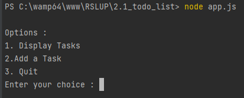
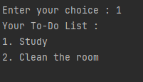
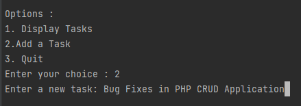
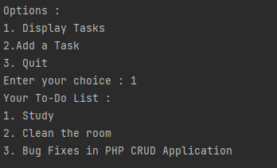
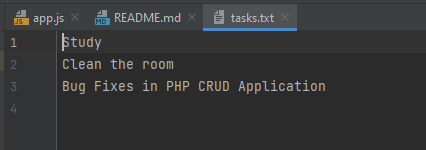

<h1>Node.js Todo List App</h1>

This is a simple todo list application built with Node.js. It allows you to manage your tasks efficiently by adding, viewing, and marking them as complete. This beginner-friendly project is an excellent way to get started with Node.js and learn the basics of file I/O.

<h2>Features</h2> 
<ul>
    <li>Add new tasks to your todo list.</li>
    <li>View your current tasks.</li>
    <li>User-friendly command-line interface.</li>
    <li>Data persistence through a text file</li>
</ul>

<h2>Getting Started</h2>
<ul>
    <li>Clone this repository.</li>
    <li>Install the required dependencies with `npm install`.</li>
    <li>Run the app using `node app.js`</li>
    <li>Follow the on-screen menu to manage your tasks.</li>
</ul>

<h2>Screenshots</h2>

